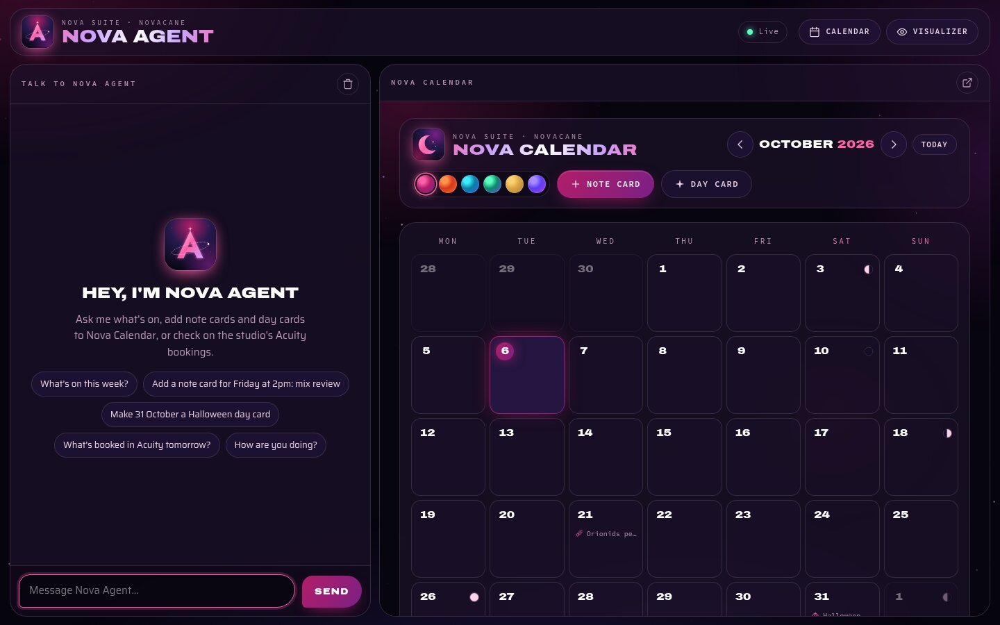
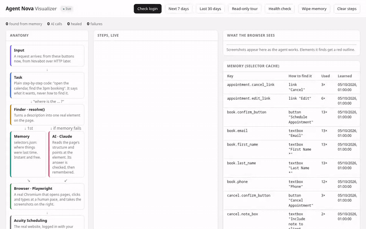

<div align="center">


# Nova Agent

**The hands that work Acuity's admin pages: a careful, self-healing browser helper for Novacane Studios.**

[](https://nodejs.org)
[](https://www.typescriptlang.org)
[](https://playwright.dev)
[](https://www.anthropic.com/claude)
[](deploy/agent-nova.service)
[](https://github.com/tuniveza/nova-suite)

</div>

---

Nova Agent is a small Node service that runs on the studio PC and drives
[Acuity Scheduling](https://acuityscheduling.com)'s admin pages in a real Chromium, the way a
person would. It does the jobs Acuity's API can't: changing a booking's **session type,
price or paid status**, plus booking, cancelling, editing and rescheduling from the command
line. It collects its jobs from [Nova Bot](https://github.com/tuniveza/nova-bot)'s Worker,
does them carefully, checks the result, and reports back to staff phones.

When Acuity moves a button, Nova Agent doesn't break: an AI element finder (Claude) works out
where the button went, the answer is checked, and the fix is remembered for next time.

## What it does

- **A chat you can talk to** (`src/chat.ts`, `http://localhost:4545`): ask Nova Agent what's on,
  add, change or remove Nova Calendar note cards and day cards ("add a note card for Friday at
  2pm", "make 31 October a Halloween day card"), look at the studio's Acuity bookings, check
  the Acuity login, or ask how it's doing. Claude answers with tools; the calendar beside the
  chat updates as it works. Acuity is read-only from the chat for now.
- **Nova Calendar built in** (`calendar/`, the [nova-calendar](https://github.com/tuniveza/nova-calendar)
  repo as a git submodule): served at `/calendar/`, saving to Nova Agent (`data/calendar.json`)
  instead of only the browser, so the chat and the calendar always agree.
- **Logs itself in** and saves the session; logs back in when it expires (the login page is
  found through the AI element finder, so it copes with layout changes).
- **Self-healing element finder** (`src/heal/`): every task says *what* it wants ("the
  Cancel Appointment button"), never *how* to find it. `resolve()` tries the selector cache
  first (instant and free), then asks Claude, checks its answer against the page, and caches
  it.
- **Appointment actions** (`src/acuity/`): list, search, book, cancel, edit and reschedule.
- **Jobs from Nova Bot** (`src/jobs.ts`): waits on the Worker for jobs, picks each one up
  within about a second, does it in Acuity, confirms it on the calendar and reports the
  result.
- **Safety first**: a dry-run mode that stops before every final click, a second layer that
  refuses any change-making request, exact-match rules for cancel and edit, and a read-only
  daily healthcheck.
- **Daily healthcheck** at 06:00 (UK time): a read-only check that every page and button can
  still be found, with alerts if not.
- **Live visualizer** (`src/visualizer/`): a local page that shows the agent's anatomy, every
  step in plain English, what the browser sees, and its memory.

## Screenshots

<p align="center"></p>

<p align="center">
  
</p>

<table>
  <tr>
    <td width="50%"><br><sub>The visualizer: anatomy (left), live steps (middle), what the browser sees and the selector memory (right).</sub></td>
    <td width="50%"><br><sub>Memory: where the agent last found each element, and how often it has used it.</sub></td>
  </tr>
</table>

Screenshots are of an idle visualizer. When it's working, the steps and browser view show
real Acuity pages and client names, which is why it only ever listens on `127.0.0.1`.

## How it works

```mermaid
flowchart LR
    C[Website customer] --> NB
    S[Staff in Nova Hub] --> NB
    NB[Nova Bot Worker] -->|queues jobs| Q[(agent_jobs)]
    NA[Nova Agent<br/>studio PC] -->|"any jobs?" long-poll| Q
    NA --> T[Task<br/>src/tasks.ts]
    T -->|"where is the …?"| R[resolve&#40;&#41;]
    R -->|1st| M[(Memory<br/>selectors.json)]
    R -->|if memory fails| AI[Claude]
    T --> B[Playwright Chromium]
    B --> A[Acuity admin pages]
    NA -->|result| NB
    NB -->|Web Push| P[Staff phones]
```



- **Jobs.** Nova Bot's Worker queues two kinds of job in its `agent_jobs` table: `change`
  (staff asked in Nova Hub to change a booking's session type, price or paid status) and
  `book`. Today the Worker only queues `change` jobs: customer bookings go through Acuity's
  own booking page so the deposit is always paid first. `book` jobs are still understood here.
- **No open ports.** Nova Agent only calls out to the Worker, so it runs on any always-on
  computer.
- **Limits.** `BOOKINGS_PER_VISITOR_PER_DAY` (default 2) is sent to the Worker each time
  Nova Agent checks in.
- **Notes on Acuity's real pages** (addresses, buttons, forms, and the safety finding that
  cancelling is a plain GET) are in [docs/acuity-ui-notes.md](docs/acuity-ui-notes.md).
  Read it before changing cancel, book or edit.

## Run it locally

You need Node 22 or newer and an Acuity account you're allowed to automate.

```sh
git clone --recurse-submodules https://github.com/tuniveza/nova-agent.git
cd nova-agent             # (already cloned? git submodule update --init  brings in calendar/)
npm install
npx playwright install chromium
cp .env.example .env      # then fill it in
npm run login             # log in once in a visible browser window
npm start                 # should say "Logged in to Acuity"
npm run visualizer        # http://localhost:4545  (chat · /calendar/ · /visualizer)
```

The chat needs `ANTHROPIC_API_KEY` in `.env` (Claude also powers the self-healing element
finder). To bring the calendar up to date with its own repo: `git submodule update --remote calendar`.

`DRY_RUN=true` is the default in `.env.example`, so book, cancel and edit stop before the
final click until you decide otherwise.

### Commands

| Command | What it does |
|---|---|
| `npm start` | Checks the login; logs in automatically if the session expired |
| `npm run login` | Opens a visible browser so you can log in by hand |
| `npm run list` | Appointments for the next 7 days |
| `npm run list -- 2026-09-01 2026-09-30` | Appointments between two dates |
| `npm run search -- name=Kai` | Search; also `type=`, `email=`, `phone=`, `from=`, `to=` (default: today to 60 days ahead) |
| `npm run book -- "type=..." date=... time=... first=... last=... email=...` | Book (stops before the final click if `DRY_RUN=true`) |
| `npm run cancel -- date=... time=... "name=..." [notify=no]` | Cancel (same safety) |
| `npm run edit -- date=... time=... "name=..." [phone= email= first= last= type= notes= newdate= newtime=]` | Edit and/or reschedule (same safety) |
| `npm run healthcheck` | Read-only check that every page and button can still be found |
| `npm run visualizer` | The live visualizer at http://localhost:4545, the daily healthcheck and job collection |
| `npm run typecheck` | Checks the code for type errors |

### Running it all the time

`deploy/agent-nova.service` is a systemd **user** service that runs the visualizer, the
daily healthcheck and job collection, starts when you log in, and restarts if it crashes.
Edit its `WorkingDirectory` to where you cloned the repo, then:

```sh
cp deploy/agent-nova.service ~/.config/systemd/user/
systemctl --user daemon-reload
systemctl --user enable --now agent-nova
journalctl --user -u agent-nova -f      # its log
systemctl --user restart agent-nova     # after changing .env or code
loginctl enable-linger $USER            # keep it running when logged out
```

On a server with no screen, `npm run login` won't work; with `ACUITY_EMAIL` and
`ACUITY_PASSWORD` set, the agent logs itself in instead. View the visualizer through an SSH
tunnel: `ssh -L 4545:localhost:4545 your-server`.

## Configuration

All settings come from `.env` (copy `.env.example`); variables already set in the shell win.
Names only here; never commit `.env`.

| Name | Default | What it's for |
|---|---|---|
| `ACUITY_EMAIL`, `ACUITY_PASSWORD` | – | Automatic re-login |
| `ACUITY_ADMIN_URL` | Acuity's appointments page | The page used to check the login |
| `ACUITY_TIMEZONE` | `Europe/London` | The business's timezone; "today" is worked out in it |
| `ANTHROPIC_API_KEY` | – | The AI element finder |
| `NOVA_MODEL` | – | The Claude model name |
| `NOVA_WORKER_URL` | Novacane's Worker | Nova Bot's Worker, where jobs come from and alerts go |
| `AGENT_NOVA_KEY` | – | Must match the Worker's `AGENT_NOVA_KEY` secret; blank = no jobs or phone alerts |
| `JOBS_EVERY_SECONDS` | `10` | How long to wait before asking again if the Worker answers at once |
| `ACTION_PAUSE_MS` | `150` | Longest human-like pause before each click or typed box (0 = flat out) |
| `BOOKINGS_PER_VISITOR_PER_DAY` | `2` | A number, or `unlimited` |
| `HEALTHCHECK_CRON` | `0 6 * * *` | When the read-only healthcheck runs |
| `VISUALIZER_PORT` | `4545` | The local visualizer |
| `HEADLESS` | `true` | Show the browser or not |
| `DRY_RUN` | `true` | Stop before every final click |
| `NOTIFY_CLIENTS` | `true` | Tick Acuity's "Send email to client" when cancelling |

Everything the agent writes at run time goes in `data/`, which git ignores: the saved login
session (`session.json`, which works like a password), the selector memory, the healthcheck
result, screenshots, daily logs (`data/logs/<date>.jsonl`, which include client names) and
`alerts.log`.

## Safety

- **Dry run** (`DRY_RUN=true`): book, cancel and edit stop before the final click. As a
  second layer, the browser refuses any request that could change something in Acuity.
  Acuity's cancel is a plain GET, so this also blocks anything carrying Acuity's
  `__csrf_magic` change token.
- **The healthcheck** always runs with that second layer on, even when live.
- **Cancel and edit** need an exact date and time match (and the client's name if given).
  If more than one appointment matches, the agent refuses.
- **Alerts** (login problems, failed healthchecks) go to the console, `data/alerts.log`, and
  staff phones through the Worker's `/hub/notify` when `AGENT_NOVA_KEY` is set. Repeats are
  held back for six hours.

## Tests

There's no automated test suite in this repo yet; `npm run typecheck` checks the types, and
`npm run healthcheck` is a read-only check against the real Acuity pages. The Worker side of
the job queue is covered by Nova Bot's tests (`test/agent-nova.spec.js`).

To try each action by hand, make a test booking in Acuity under a made-up name with your own
email, then run (with `DRY_RUN=true` first to rehearse):

```sh
npm run edit -- date=2026-10-31 time=17:00 "name=Dana Hollis" phone=07700900789 "notes=Test note from Nova Agent"
npm run edit -- date=2026-10-31 time=17:00 "name=Dana Hollis" newdate=2026-11-04 newtime=14:00
npm run book -- "type=Voiceover Recording with Engineer - 1 hour" date=2026-11-05 time=15:00 first=Agent last=Test email=you@example.com
npm run cancel -- date=2026-11-05 time=15:00 "name=Agent Test"
npm run cancel -- date=2026-11-04 time=14:00 "name=Dana Hollis"
```

Each one ends with ✓ or ✗. The visualizer's **Read-only tour** shows the AI element finder at
work: the first run heals each element and saves it, the second comes straight from memory,
and **Wipe memory** lets you watch it heal again.

## Project layout

```
src/index.ts              command-line entry point
src/config.ts             every setting, read once from .env
src/browser.ts            Chromium, the saved session and the change-blocking safety layer
src/tasks.ts              the tasks (check login, list, search, book, cancel, edit)
src/jobs.ts               collecting jobs from Nova Bot's Worker and reporting results
src/healthcheck.ts        the daily read-only healthcheck
src/alerts.ts             alerts to the console, data/alerts.log and staff phones
src/llm.ts                the Claude client
src/chat.ts               the chat: Claude with calendar, Acuity (read-only) and status tools
src/calendar/store.ts     Nova Calendar's data, kept in data/calendar.json
src/heal/                 resolve() and the selector cache
src/acuity/               Acuity pages: login, list, book, cancel, edit, targets, types
src/trace.ts              every step, for the console, logs and visualizer
src/visualizer/           the local pages: chat.html (the chat), page.html (the visualizer),
                          calendar-sync.js (makes the calendar save to Nova Agent), server.ts
calendar/                 Nova Calendar (git submodule: tuniveza/nova-calendar)
deploy/agent-nova.service systemd user service
docs/acuity-ui-notes.md   what Acuity's real admin pages look like
docs/media/               README images
```

## Part of the Nova suite

| Project | What it is |
|---|---|
| [nova-suite](https://github.com/tuniveza/nova-suite) | The Nova suite: an overview of every project |
| [nova-bot](https://github.com/tuniveza/nova-bot) | The website chat assistant, booking card and Nova Hub |
| **[nova-agent](https://github.com/tuniveza/nova-agent)** | This repo: the browser helper that does jobs in Acuity's admin pages |
| [nova-club](https://github.com/tuniveza/nova-club) | Members' Android app that shows the studio's busy times |
| [nova-calendar](https://github.com/tuniveza/nova-calendar) | A cosmic calendar of note cards and day cards |
| [nova-notes](https://github.com/tuniveza/nova-notes) | Nova Notes (in progress) |
| [nova-observatory](https://github.com/tuniveza/nova-observatory) | A dashboard of every project, with screenshots and video |

## Licence

All rights reserved — Novacane Studios.
