<div align="center">

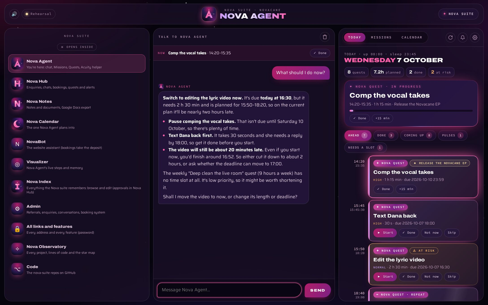

# Nova Agent

**Your planner, your chat and the studio's hands in Acuity, on the studio computer.**<br>
Talk to it, give it a goal, and it plans your days to the second. It also works Acuity's admin pages for Novacane Studios.

[](https://nodejs.org)
[](https://www.typescriptlang.org)
[](https://playwright.dev)
[](https://www.anthropic.com/claude)
[](deploy/agent-nova.service)
[](https://github.com/tuniveza/nova-suite)

</div>

---

Nova Agent is a small Node service that runs on the studio PC. Open `http://localhost:4545`
and you get one screen in three parts: the **Nova suite** down the left, a **chat** with Nova
Agent dead centre, and **your plan** on the right (Today, Missions and Nova Calendar).

Behind the chat sits a planner: tell it a goal and it becomes a **Nova Mission** of **Nova
Quests**, fitted around your sleep, your calendar and your travel, with reminders and
check-ins as you go. And behind that sits the job it started with: a careful, self-healing
browser helper that does what [Acuity Scheduling](https://acuityscheduling.com)'s API can't,
for [Nova Bot](https://github.com/tuniveza/nova-bot).

All the pictures here come from a separate sample copy with made-up quests and people.

## At a glance

| | |
|---|---|
| **Chat** | Claude, with tools for quests, missions, Nova Calendar, Acuity (read-only) and its own status |
| **Nova Missions and Quests** | Goals broken into quests, planned hour by hour (to the second), re-planned on every change |
| **Reminders** | Pop-ups, check-ins, a morning plan and evening wrap-up, chimes, system notifications and Nova Hub phones |
| **Nova Calendar** | Built in, saving to Nova Agent, so the chat and the calendar always agree |
| **Nova suite** | Every app one tap away, opened inside Nova Agent or in its own window |
| **Nova Index** | Reads what the suite remembers before it replies, and learns after |
| **Acuity helper** | Changes session types, prices and paid status for Nova Bot, safely, healing itself when pages change |
| **Visualizer** | Every step the Acuity helper takes, live |

## See it work

<p align="center">
  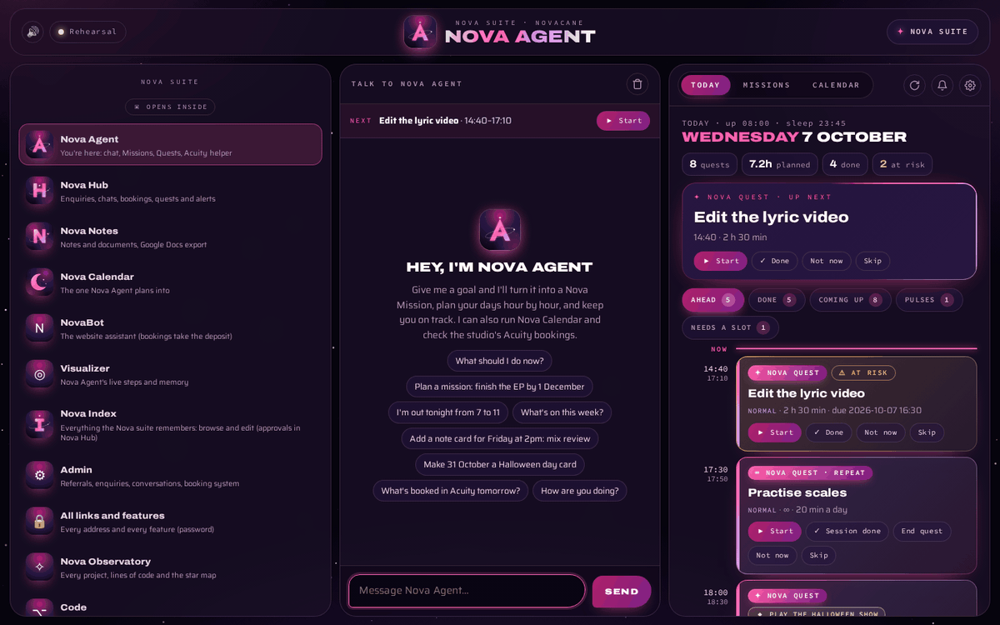<br>
  <sub>Ask for a quest, watch it land in the plan, then Start and Done.</sub>
</p>

<p align="center">
  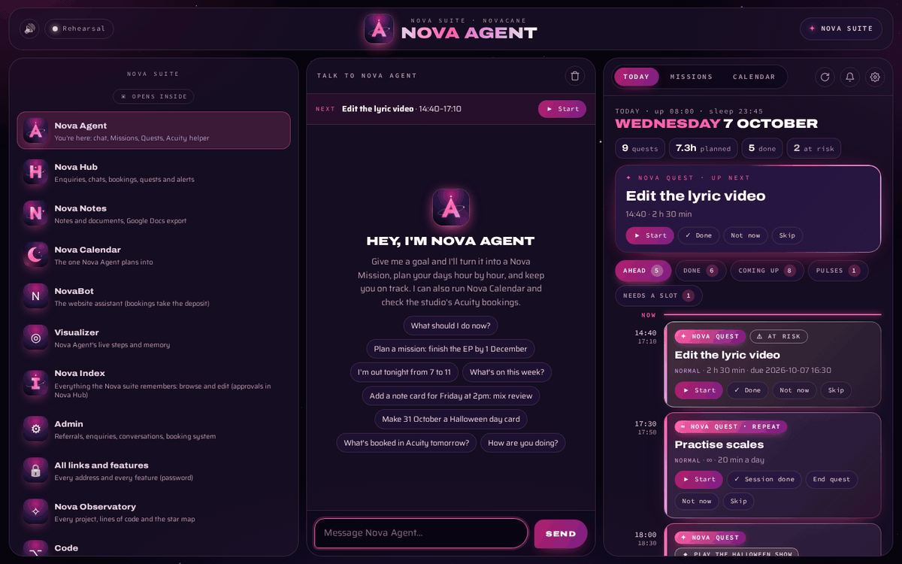<br>
  <sub>The rail opens Nova Calendar, Nova Notes and Nova Index inside Nova Agent; "← Nova Agent" brings the chat back.</sub>
</p>

## What it does

### The chat, in the middle

Nova Agent's chat (`src/chat.ts`) is Claude with tools. Ask it what to do next ("What should I
do now?" gives one clear recommendation), plan a mission, block out an evening ("I'm out tonight
from 7 to 11"), push your day back ("I'm running late"), add or change Nova Calendar note
cards and day cards ("make 31 October a Halloween day card"), look at the studio's Acuity
bookings, check the Acuity login, or ask how Nova Agent is doing. Whatever it changes shows
up as a little chip under its reply, and the plan beside it redraws straight away.

On a wide screen the three columns sit side by side; on a narrow one (a phone, a small
window) **Chat** and **Plan** become two tabs. The "Now" strip above the chat always shows the
quest in progress or the next one, with its Done or Start button.

### Nova Missions and Nova Quests

<table>
  <tr>
    <td width="33%">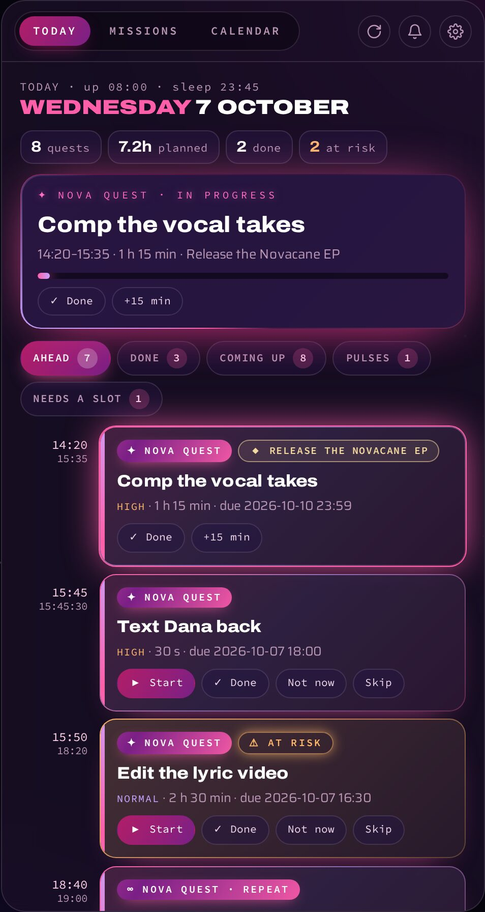</td>
    <td width="33%">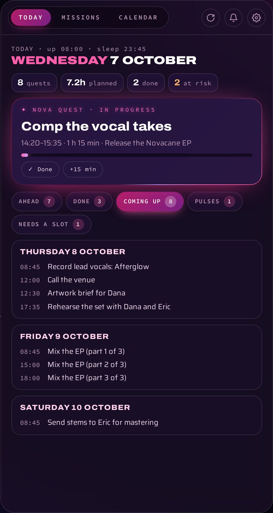</td>
    <td width="33%">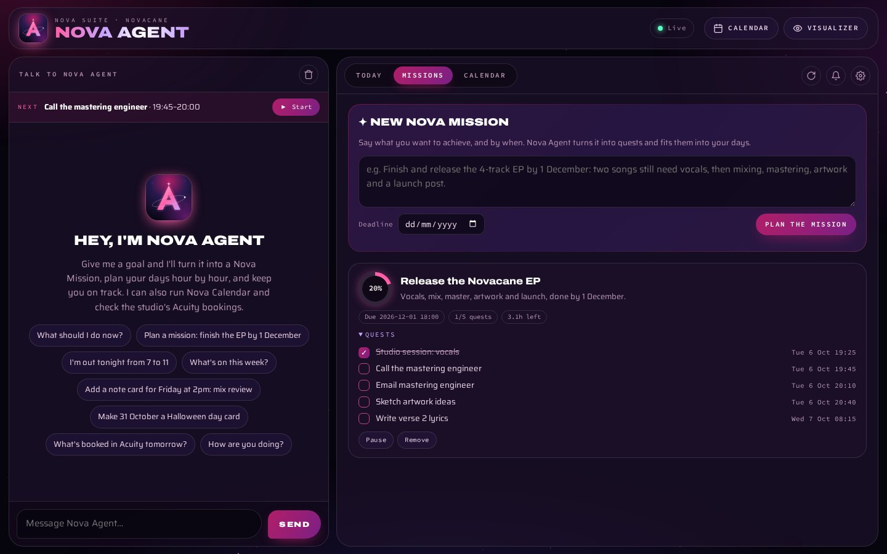</td>
  </tr>
  <tr>
    <td><sub><b>Today</b>: the now card, then Ahead, Done, Coming up, Pulses and Needs a slot.</sub></td>
    <td><sub><b>Coming up</b>: the next few days at a glance.</sub></td>
    <td><sub><b>Missions</b>: each one's progress ring and its quests.</sub></td>
  </tr>
</table>

Tell Nova Agent a goal ("release the EP by 1 December") and it becomes a **Mission**: Claude
breaks it into **Quests** (`src/quests/planner.ts`), each with a length, a priority, a deadline,
what it waits for, where it happens and the travel to get there. Then a planner with no AI in
it (`src/quests/scheduler.ts`) fits every quest into your days:

- around your **rhythm**: get up, a start-up time, wind-down and bedtime, a buffer between
  quests, a proper break after long ones, and a cap on quest hours per day (the ⚙ button);
- around Nova Calendar entries and any **blocked time**;
- most urgent first (deadline pressure weighted by priority), never before the quests it
  depends on, in the part of the day it suits;
- with **travel time** in front of anything somewhere else, and a "leave by" reminder;
- flagging anything that can't make its deadline as **at risk**, and anything that can't be
  placed at all under **Needs a slot**, with the reason.

**Any length, from a second to forever** (`src/quests/lengths.ts`):

| Kind | Example | How it's planned |
|---|---|---|
| Seconds | "Text Dana back", 30 s | Placed to the second; quick ones go back to back |
| Hours | "Comp the vocal takes", 1 h 15 min | One slot |
| Long work | "Mix the EP", 8 h | Split into sessions of up to 3 hours ("part 2 of 3"), in order |
| Ongoing | "Practise scales", 20 min a day | A session every day, weekday, week or any interval, until you end it or its deadline passes |
| Pulse | "Drink some water", every 2 min | Repeats faster than every 5 minutes run on their own exact timer (down to every second), only while you're awake, without taking slots in the plan |

**Pace limits** (in the rhythm) are the safety switch: on, quests start a few minutes from now,
on 5-minute marks, with buffers and breaks; off, they can start right now, to the second,
back to back.

It **re-plans on every change**: finish early and the rest moves up, press Not now and it finds
a new slot, and a quest left unanswered an hour after its end is moved and you're told where.
Missions can be paused, resumed or removed, and a mission finishes itself when its last quest
is done.

### Reminders, check-ins and chimes

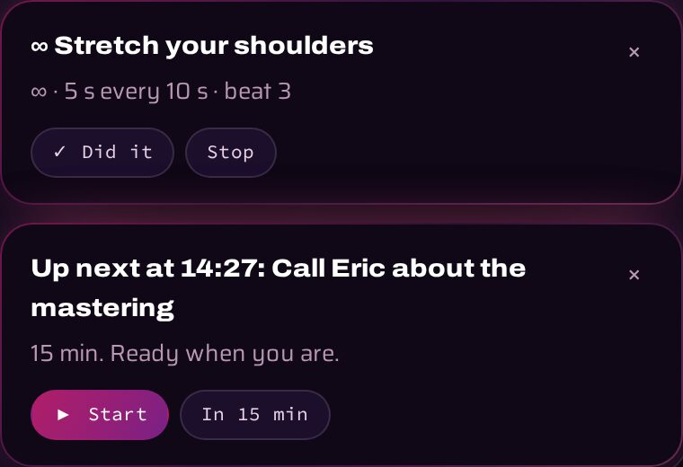

Checked every 10 seconds (`src/quests/reminders.ts`):

- a **reminder** before each quest (or before you need to leave), with Start and In 15 min;
- a **check-in** when it should be finished: Done, +15 min or Move it;
- a **morning plan** and an **evening wrap-up**;
- each **pulse** as one ticking card that counts its beats, instead of a pile of pop-ups.

Each kind has its own bright **chime**, made live in the browser. Press 🔔 for **system
notifications**, which arrive even with Nova Agent in the background and bring it back when
clicked. With the rhythm's phone setting on, they also go to the **Nova Hub phones**, where Nova
Agent, Nova Quest and Nova Mission alerts each have their own label, check-ins stay on screen
until they're answered, and a pulse replaces its last notification.

<br clear="right">

### Quests in Nova Hub

Nova Agent sends its plan (missions, quests, pulses, and Nova Calendar's note and day cards)
to Nova Bot's worker whenever it changes, and every minute so "now" keeps moving
(`src/quests/hubsync.ts`). Nova Hub's Quests and Calendar tabs show it on the staff phones,
and taps made there (Done, Start, Not now, Skip, pause a mission) come back with each job
check and are carried out within about a second.

### Nova Calendar, built in

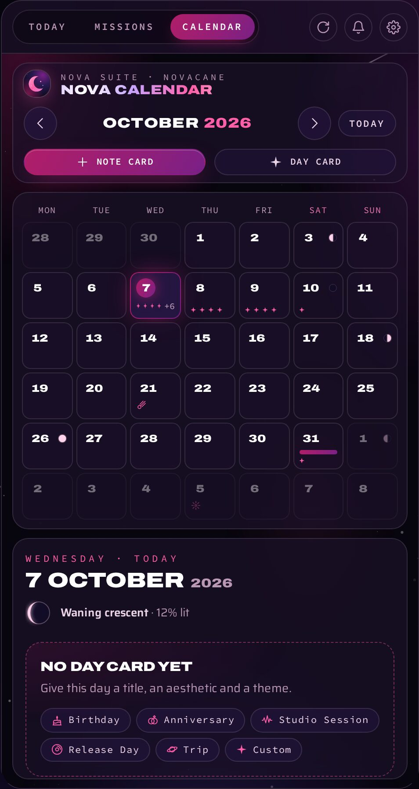

[Nova Calendar](https://github.com/tuniveza/nova-calendar) lives in `calendar/` (a git
submodule) and is served at `/calendar/`. Inside Nova Agent it saves to `data/calendar.json`
instead of only the browser, so the chat, the planner and the calendar always see the same
note cards and day cards. Every planned quest and blocked time shows up in it as a note card
(✦ for a quest, ∞ for a repeat, ⚠ when at risk, ✓ when done), and its theme colours the whole
of Nova Agent. The **Calendar** tab fits it to the plan column with no scrolling.

<br clear="right">

### The Nova suite, inside or in a window

<table>
  <tr>
    <td width="42%">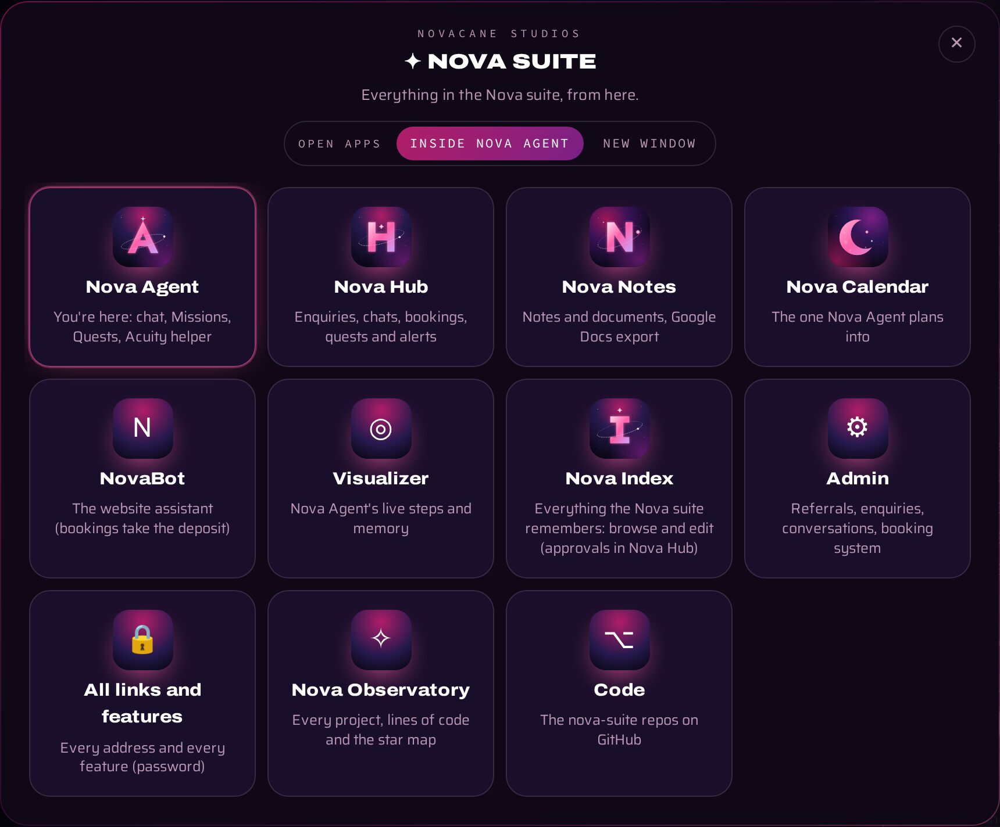</td>
    <td width="58%">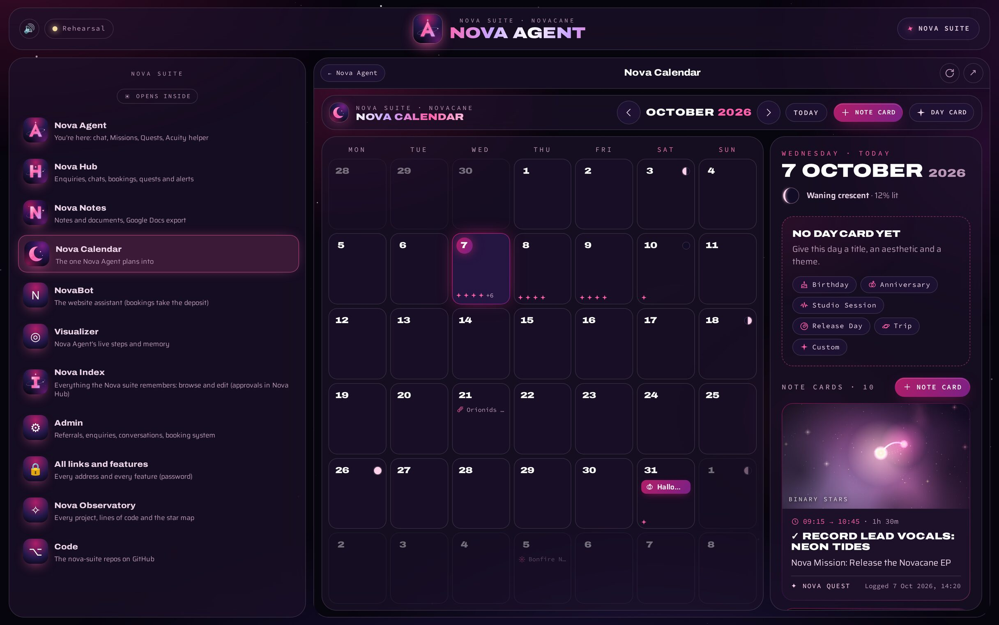</td>
  </tr>
  <tr>
    <td><sub>The <b>✦ Nova suite</b> launcher, with the "Open apps" switch.</sub></td>
    <td><sub>Nova Calendar opened inside Nova Agent from the rail.</sub></td>
  </tr>
</table>

The rail down the left (and the ✦ Nova suite launcher) holds every Nova app: Nova Hub, Nova
Notes, Nova Calendar, NovaBot, the visualizer, Nova Index, Admin, all links and features,
Nova Observatory and the code. One switch decides where they open:

- **Inside Nova Agent**: the app takes the middle of the screen, with "← Nova Agent", reload
  and "↗ open in its own window" above it. Nova Agent serves Nova Calendar, Nova Notes
  (`/notes/`), Nova Observatory (`/observatory/`) and Nova Index (`/app/memory/`) itself, from
  the folders next to it, so they open inside in any browser.
- **New window**: each app in its own tab or window.

Nova Hub, Admin and the links page always get their own window: they refuse to be shown
inside other pages, which keeps their sign-in safe, and Nova Agent says so once.

### Sound effects

Soft cosmic bells and sparkles for every tap, tab, switch, open, close, send, done and
delete, made live with the Web Audio API (no sound files) in D major pentatonic, so it all
sounds like one family. Nova Agent chimes when it answers. The 🔊 switch at the top left turns
them off, and the choice is remembered on that computer. It's the same `sfx.js` every Nova
suite app uses.

### Nova Index: it remembers

Before each reply and each mission plan, Nova Agent asks [Nova Index](https://github.com/tuniveza/nova-index)
(the suite's shared memory, on Nova Bot's worker) for the few facts that matter: the studio's,
and those of the person Nova Agent works for (found by itself: see below). The read is quick (a short
timeout and a 30-second cache) and never holds a reply up for long. After each conversation,
the exchange is handed back to be learned from, in the background (`src/memory.ts`). It reads
studio and staff memory only, never customers'.

Nova Index itself opens inside Nova Agent from the rail, through Nova Agent's own key:
you can browse and edit the studio's and staff memory there, while approvals of customers'
facts stay behind Nova Hub's sign-in. Without `AGENT_NOVA_KEY`, memory is simply switched off.

### The Acuity helper

The job Nova Agent was built for. It drives Acuity's admin pages in a real Chromium, the way a
person would, for the jobs Acuity's API can't do.

- **Jobs from Nova Bot** (`src/jobs.ts`): it waits on the worker for jobs and picks each one up
  within about a second. Today that's `change` jobs (staff asked in Nova Hub to change a
  booking's session type, price or paid status); it does them in Acuity, checks the result and
  reports back to staff phones. Customer bookings go through Acuity's own booking page, so the
  deposit is always paid first; `book` jobs are still understood here.
- **Logs itself in** and saves the session; logs back in when it expires.
- **Self-healing element finder** (`src/heal/`): every task says *what* it wants ("the Cancel
  Appointment button"), never *how* to find it. `resolve()` tries the selector memory first
  (instant and free), then asks Claude, checks the answer against the page, and remembers it.
- **Appointment actions** (`src/acuity/`) from the command line: list, search, book, cancel,
  edit and reschedule.
- **Safety first**: a dry-run mode that stops before every final click, a second layer that
  refuses any change-making request, exact-match rules for cancel and edit, and a read-only
  healthcheck every morning. See [Safety](#safety).

### The visualizer

<table>
  <tr>
    <td width="50%">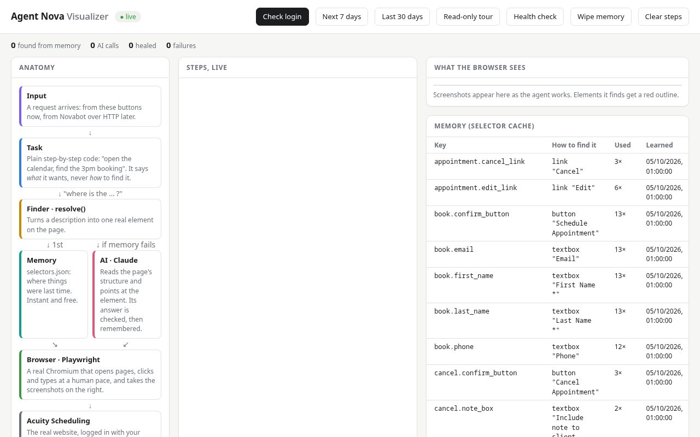<br><sub>Anatomy, live steps, what the browser sees and the selector memory.</sub></td>
    <td width="50%">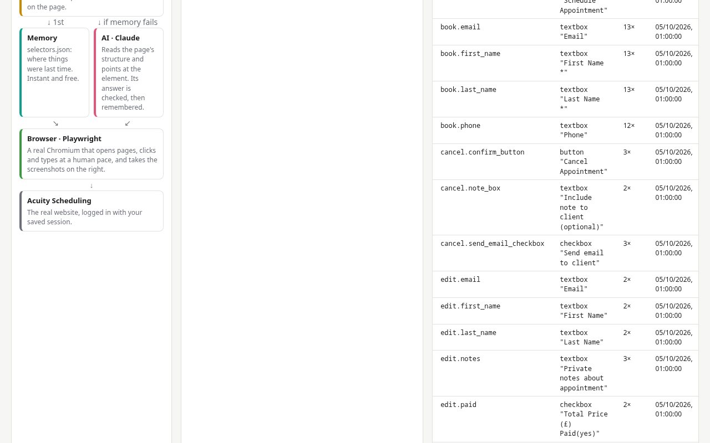<br><sub>Where the agent last found each element, and how often.</sub></td>
  </tr>
</table>

`/visualizer` shows the Acuity helper at work: its anatomy, every step in plain English, what
the browser sees, and its memory. Its buttons only ever run read-only tasks (check the login,
the next 7 or last 30 days, a read-only tour, the healthcheck), and **Wipe memory** lets you
watch it heal again. These screenshots are of an idle visualizer: at work it shows real
Acuity pages and client names, which is why Nova Agent only ever listens on `127.0.0.1`.

### An app for your launcher

Open `http://localhost:4545` in a Chromium browser and press **Install app**: Nova Agent opens
in its own window, with shortcuts to Today, a new mission, Nova Calendar and the visualizer.
Its service worker shows reminders as system notifications; nothing is cached, because Nova
Agent is its own server on the same machine.

## How it works

```mermaid
flowchart LR
    You[You, at the studio PC] --> UI[Nova Agent page<br/>chat · plan · suite]
    UI --> Chat[Chat<br/>src/chat.ts] --> Claude[Claude]
    Chat --> Q[(Quests and calendar<br/>data/)]
    UI --> Q
    Chat <-->|reads before, learns after| NI[Nova Index<br/>on Nova Bot's worker]
    Q -->|plan, reminders| Hub[Nova Hub phones]
    S[Staff in Nova Hub] --> NB[Nova Bot Worker]
    NB -->|queues jobs| J[(agent_jobs)]
    NA[Acuity helper] -->|"any jobs?" long-poll| J
    NA --> R[resolve&#40;&#41;] -->|1st| M[(Selector memory)]
    R -->|if memory fails| Claude
    NA --> B[Playwright Chromium] --> A[Acuity admin pages]
    NA -->|result| NB
```

- **No open ports.** Nova Agent only listens on `127.0.0.1` and only calls out to the worker,
  so it runs on any always-on computer.
- **Limits.** `BOOKINGS_PER_VISITOR_PER_DAY` (default 2) is sent to the worker each time Nova
  Agent checks in.
- **Notes on Acuity's real pages** (addresses, buttons, forms, and the safety finding that
  cancelling is a plain GET) are in [docs/acuity-ui-notes.md](docs/acuity-ui-notes.md). Read it
  before changing cancel, book or edit.

## Run it locally

You need Node 22 or newer. Acuity is only needed for the Acuity helper, and only with an
account you're allowed to automate.

```sh
git clone --recurse-submodules https://github.com/tuniveza/nova-agent.git
cd nova-agent             # (already cloned? git submodule update --init  brings in calendar/)
npm install
npx playwright install chromium
cp .env.example .env      # then fill it in
npm run visualizer        # http://localhost:4545  (chat · /calendar/ · /visualizer)
npm run login             # for the Acuity helper: log in once in a visible browser window
npm start                 # should say "Logged in to Acuity"
```

The chat and mission planning need `ANTHROPIC_API_KEY` in `.env` (Claude also powers the
self-healing element finder). Jobs, phone alerts, Nova Hub sync and Nova Index memory need
`AGENT_NOVA_KEY`; without it they're simply off. To bring the calendar up to date with its own
repo: `git submodule update --remote calendar`.

Nova Observatory, Nova Notes and Nova Index open inside Nova Agent when their repos sit next
to this one (`../no`, `../nn`, `../ni`).

`DRY_RUN=true` is the default in `.env.example`, so book, cancel and edit stop before the
final click until you decide otherwise.

### A second copy with sample data

`NOVA_DATA_DIR` points Nova Agent at another data folder, so a preview or a screenshots copy
never touches the real quests, calendar or Acuity session:

```sh
NOVA_DATA_DIR=/tmp/nova-sample AGENT_NOVA_KEY= DRY_RUN=true VISUALIZER_PORT=4547 npm run visualizer
```

With `AGENT_NOVA_KEY` empty it won't collect jobs, read memory or send phone alerts.

### Commands

| Command | What it does |
|---|---|
| `npm run visualizer` | Nova Agent itself: the chat and plan at http://localhost:4545, reminders, Nova Hub sync, the daily healthcheck and job collection (`npm run service` is the same) |
| `npm start` | Checks the Acuity login; logs in automatically if the session expired |
| `npm run login` | Opens a visible browser so you can log in to Acuity by hand |
| `npm run list` | Appointments for the next 7 days |
| `npm run list -- 2026-09-01 2026-09-30` | Appointments between two dates |
| `npm run search -- name=Kai` | Search; also `type=`, `email=`, `phone=`, `from=`, `to=` (default: today to 60 days ahead) |
| `npm run book -- "type=..." date=... time=... first=... last=... email=...` | Book (stops before the final click if `DRY_RUN=true`) |
| `npm run cancel -- date=... time=... "name=..." [notify=no]` | Cancel (same safety) |
| `npm run edit -- date=... time=... "name=..." [phone= email= first= last= type= notes= newdate= newtime=]` | Edit and/or reschedule (same safety) |
| `npm run healthcheck` | Read-only check that every Acuity page and button can still be found |
| `npm run typecheck` | Checks the code for type errors |

### Running it all the time

`deploy/agent-nova.service` is a systemd **user** service that runs Nova Agent (the page,
reminders, the daily healthcheck and job collection), starts when you log in, and restarts if
it crashes. Edit its `WorkingDirectory` to where you cloned the repo, then:

```sh
cp deploy/agent-nova.service ~/.config/systemd/user/
systemctl --user daemon-reload
systemctl --user enable --now agent-nova
journalctl --user -u agent-nova -f      # its log
systemctl --user restart agent-nova     # after changing .env or code
loginctl enable-linger $USER            # keep it running when logged out
```

On a server with no screen, `npm run login` won't work; with `ACUITY_EMAIL` and
`ACUITY_PASSWORD` set, the agent logs itself in instead. View it through an SSH tunnel:
`ssh -L 4545:localhost:4545 your-server`.

## Configuration

All settings come from `.env` (copy `.env.example`); variables already set in the shell win.
Names only here; never commit `.env`.

| Name | Default | What it's for |
|---|---|---|
| `ANTHROPIC_API_KEY` | – | The chat, mission planning and the AI element finder |
| `NOVA_MODEL` | `claude-opus-5-5` | The Claude model name |
| `NOVA_WORKER_URL` | Novacane's worker | Nova Bot's worker: jobs, alerts, Nova Hub sync and Nova Index |
| `AGENT_NOVA_KEY` | – | Must match the worker's `AGENT_NOVA_KEY` secret; blank = no jobs, phone alerts, Nova Hub sync or memory |
| `NOVA_STAFF_ID` | *(found by itself)* | Only to force who Nova Agent works for. Without it, Nova Agent picks the studio's first Nova Portal admin, and anyone can switch it to themselves with **Connect as me** on the Nova Portal badge (kept in `data/staff.json`) |
| `NOVA_DATA_DIR` | `data/` | Where everything is kept; point a second copy somewhere else |
| `ACUITY_EMAIL`, `ACUITY_PASSWORD` | – | Automatic re-login |
| `ACUITY_ADMIN_URL` | Acuity's appointments page | The page used to check the login |
| `ACUITY_TIMEZONE` | `Europe/London` | The business's timezone; "today" is worked out in it |
| `JOBS_EVERY_SECONDS` | `10` | How long to wait before asking again if the worker answers at once |
| `ACTION_PAUSE_MS` | `150` | Longest human-like pause before each click or typed box (0 = flat out) |
| `BOOKINGS_PER_VISITOR_PER_DAY` | `2` | A number, or `unlimited` |
| `HEALTHCHECK_CRON` | `0 6 * * *` | When the read-only healthcheck runs (UK time) |
| `VISUALIZER_PORT` | `4545` | Nova Agent's page |
| `HEADLESS` | `true` | Show the browser or not |
| `DRY_RUN` | `true` | Stop before every final click (the status pill says **Rehearsal**) |
| `NOTIFY_CLIENTS` | `true` | Tick Acuity's "Send email to client" when cancelling |

Your rhythm (wake, sleep, buffers, breaks, the daily cap, reminders, check-ins, briefings, phone
alerts and pace limits) is set on the page with ⚙, or by asking the chat.

Everything Nova Agent writes at run time goes in `data/` (or `NOVA_DATA_DIR`), which git
ignores: quests and missions (`quests.json`), the calendar (`calendar.json`), the saved Acuity
session (`session.json`, which works like a password), the selector memory, the healthcheck
result, screenshots, daily logs (`logs/<date>.jsonl`, which include client names) and
`alerts.log`.

## Safety

- **Dry run** (`DRY_RUN=true`): book, cancel and edit stop before the final click. As a second
  layer, the browser refuses any request that could change something in Acuity. Acuity's
  cancel is a plain GET, so this also blocks anything carrying Acuity's `__csrf_magic` change
  token.
- **The healthcheck** always runs with that second layer on, even when live.
- **Cancel and edit** need an exact date and time match (and the client's name if given). If
  more than one appointment matches, the agent refuses.
- **The chat is read-only in Acuity**: it can look at bookings and check the login, never book,
  move or cancel.
- **The page's buttons** only work from the page itself (a custom header other websites can't
  send), and Nova Agent only listens on this computer.
- **Alerts** (login problems, failed healthchecks) go to the console, `data/alerts.log`, and
  staff phones through the worker when `AGENT_NOVA_KEY` is set. Repeats are held back for six
  hours.

## Tests

`npx tsx test/scheduler.test.ts` checks the Nova Quest planner (sleep, deadlines, priorities,
dependencies, travel, buffers, breaks, the daily cap, blocked time and at-risk flags).
`npm run typecheck` checks the types, and `npm run healthcheck` is a read-only check against
the real Acuity pages. The worker side of the job queue is covered by Nova Bot's tests
(`test/agent-nova.spec.js`).

To try each Acuity action by hand, make a test booking in Acuity under a made-up name with
your own email, then run (with `DRY_RUN=true` first to rehearse):

```sh
npm run edit -- date=2026-10-31 time=17:00 "name=Dana Hollis" phone=07700900789 "notes=Test note from Nova Agent"
npm run edit -- date=2026-10-31 time=17:00 "name=Dana Hollis" newdate=2026-11-04 newtime=14:00
npm run book -- "type=Voiceover Recording with Engineer - 1 hour" date=2026-11-05 time=15:00 first=Agent last=Test email=you@example.com
npm run cancel -- date=2026-11-05 time=15:00 "name=Agent Test"
npm run cancel -- date=2026-11-04 time=14:00 "name=Dana Hollis"
```

Each one ends with ✓ or ✗. The visualizer's **Read-only tour** shows the AI element finder at
work: the first run heals each element and saves it, the second comes straight from memory.

## Project layout

```
src/visualizer/server.ts  Nova Agent's server: the pages, the plan's API, the suite apps, reminders
src/visualizer/chat.html  the main page: the Nova suite rail, the chat, Today, Missions, Calendar
src/visualizer/page.html  the visualizer
src/visualizer/app/       the installable app: manifest, service worker, icons, sfx.js (sound effects)
src/visualizer/calendar-sync.js  makes Nova Calendar save to Nova Agent
src/chat.ts               the chat: Claude with quest, calendar, Acuity (read-only) and status tools
src/memory.ts             Nova Index: what the suite remembers, read before replies, learned after
src/config.ts             every setting, read once from .env
src/quests/store.ts       Missions, Quests, blocked time and your rhythm (quests.json)
src/quests/scheduler.ts   the planner: places every quest at a time, to the second (no AI)
src/quests/lengths.ts     lengths from a second to forever: sessions, repeats, plain words
src/quests/pulses.ts      repeats faster than every 5 minutes, each on its own timer
src/quests/planner.ts     turning a goal into a Mission and its Quests (Claude)
src/quests/plan.ts        re-planning, and mirroring quests into Nova Calendar
src/quests/reminders.ts   reminders, check-ins, the morning plan and evening wrap-up
src/quests/hubsync.ts     the plan to Nova Hub, and Nova Hub's taps back
src/quests/actions.ts     everything the chat and the page can do with them
src/calendar/store.ts     Nova Calendar's data (calendar.json)
src/index.ts              command-line entry point for the Acuity helper
src/browser.ts            Chromium, the saved session and the change-blocking safety layer
src/tasks.ts              the tasks (check login, list, search, book, cancel, edit)
src/jobs.ts               collecting jobs from Nova Bot's worker and reporting results
src/healthcheck.ts        the daily read-only healthcheck
src/alerts.ts             alerts to the console, alerts.log and staff phones
src/llm.ts                the Claude client
src/heal/                 resolve() and the selector memory
src/acuity/               Acuity pages: login, list, book, cancel, edit, targets, types
src/trace.ts              every step, for the console, logs and visualizer
test/scheduler.test.ts    planner checks
calendar/                 Nova Calendar (git submodule: tuniveza/nova-calendar)
deploy/agent-nova.service systemd user service
docs/acuity-ui-notes.md   what Acuity's real admin pages look like
docs/media/               README images
```

## Part of the Nova suite

| Project | What it is |
|---|---|
| [nova-suite](https://github.com/tuniveza/nova-suite) | The Nova suite: an overview of every project |
| [nova-bot](https://github.com/tuniveza/nova-bot) | The website chat assistant, booking card and Nova Hub |
| **[nova-agent](https://github.com/tuniveza/nova-agent)** | This repo: the chat and planner on the studio computer, and the Acuity helper |
| [nova-index](https://github.com/tuniveza/nova-index) | Everything the Nova suite remembers, browsable |
| [nova-club](https://github.com/tuniveza/nova-club) | Members' Android app that shows the studio's busy times |
| [nova-calendar](https://github.com/tuniveza/nova-calendar) | A cosmic calendar of note cards and day cards |
| [nova-notes](https://github.com/tuniveza/nova-notes) | A note editor that writes from the centre outwards |
| [nova-observatory](https://github.com/tuniveza/nova-observatory) | A dashboard of every project, with screenshots and video |

## Licence

All rights reserved — Novacane Studios.
